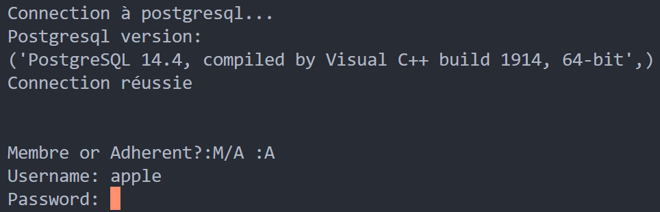
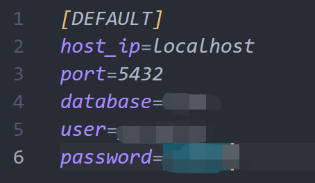
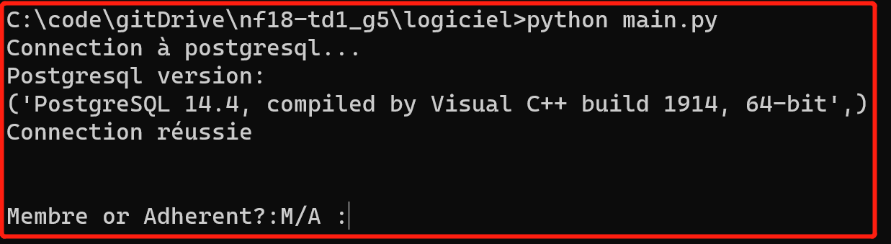
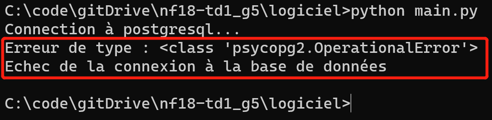

# Project NF18 2022 Biblio

Group 5:
- [Cassandra Le Roux](https://gitlab.utc.fr/lerouxca)
- [Camille Josserand](https://gitlab.utc.fr/cjossera) 
- [Chloe Bolle-Reddat](https://gitlab.utc.fr/cbollere)
- [ZHANG Houze](https://github.com/HouzeZHANG)

Interactive library management system based on psycopg2 and python, as a course project for NF18 in 2022



## Acknowledgement & Features <!-- omit in toc -->

This project is implemented based on [psycopg2](https://github.com/fuergaosi233/wechat-chatgpthttps://www.psycopg.org/docs/), [python3](https://www.python.org/downloads/) and [postgresql](https://www.postgresql.org/)

- Support for json fields

## 0. Table of Content <!-- omit in toc -->

- [Project NF18 2022 Biblio](#project-nf18-2022-biblio)
  - [1. How to Deploy this Python Application?](#1-how-to-deploy-this-python-application)

## 1. How to Deploy this Python Application?

1. [Install](https://www.postgresql.org/download/) Postgresql Client
2. Create test_database in local database or remote database server
```sql
CREATE DATABASE [testdb]
```
3. Clone this repository to local
```git
git clone git@gitlab.utc.fr:cjossera/nf18-td1_g5.git
```
4. Create tables and insert example datas
```cmd
psql -U [username] -d [testdb] -a -f SQL_CREATE_TABLE.sql
psql -U [username] -d [testdb] -a -f SQL_INSERT.sql
```
5. Configure parameters in [main.py](logiciel/main.py)

6. Run [main.py](logiciel/main.py) in terminal
```cmd
python main.py
```
If you can see following lines, congratulation!

If the following occurs, it means there is a problem with your configuration, please check again if all the parameters are set correctly
